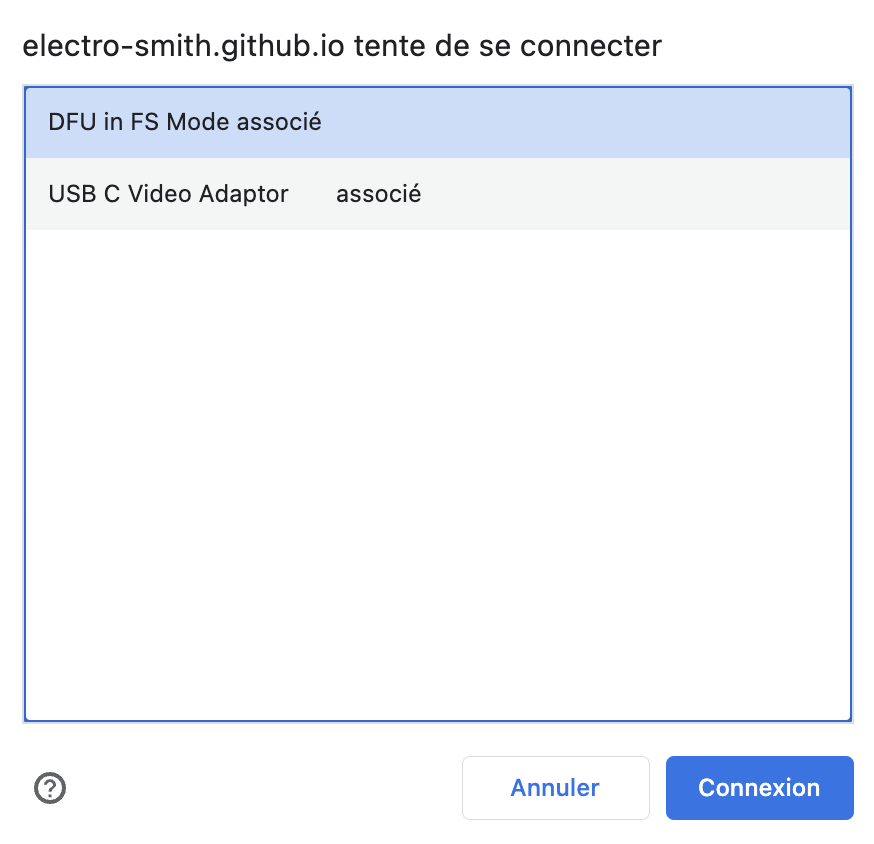
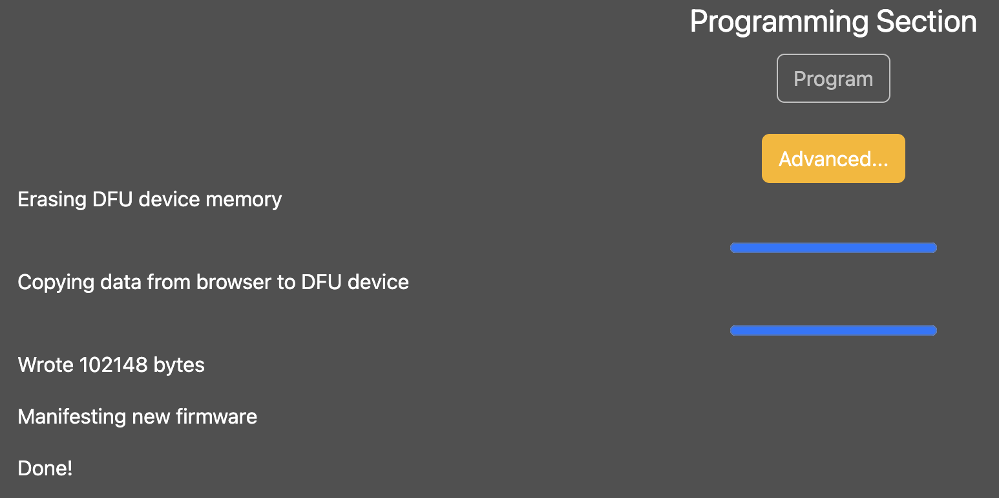

## Beta firmware

**Keep in mind that the purpose of this release is to test functionalities and is subject to frequent change.**
- Pitch Fine tune : overall functional, but it's still touchy to get back to the exact pot and shifted pot positions.

## Downloading and installing the beta firmware

Download the latest beta firmware [here](https://github.com/OmsInSerial/Eurorack/blob/a56d0bad11b1bcb0b248de3fc0dd87fe343cce45/FM%20Einheit/files/FMEinheit_beta.bin). Click on the Download raw file button.
 

You can use the [ElectroSmith web configurator page](https://electro-smith.github.io/Programmer/) to do so with a last updated Google Chrome.

Follow this procedure:

1. Connect the Daisy to the Computer with a USB C cable.

2. Enter the system bootloader by holding the BOOT button down, and then pressing, and releasing the RESET button.

3. Click the Connect button at the top of the page.

4. Select, "DFU in FS Mode" and click connexion.

   

5. Click the Choose File button, and select the .bin file you downloaded.

6. Click Program, and wait for the progress bar to finish.

   

Now, if the program does not start immediatley, pressing RESET on the Daisy will cause the program to start running.

Requirements : 
In order to use this, you will need: an up-to-date version of Chrome, at least version 61 or newer
