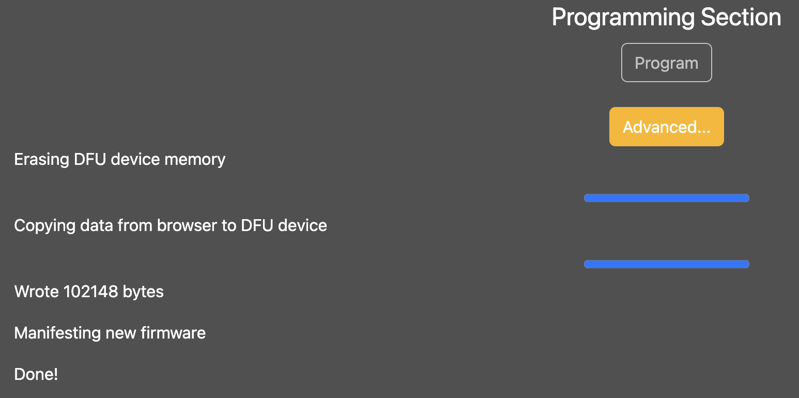

# VCV Rack 2 modules

FM Einheit is a 2 operators FM synthesis module.
With its flexible FM engine, FM Einheit allows you to patch almost every algorithm you dream about.

Imagine you get 2 or more modules... and you are in the DX7 territory within Eurorack!

This module is developed under macOS with the help of [Erb Eurorack-Blocks](https://github.com/ohmtech-rdi/eurorack-blocks) framework + ElectroSmith Daisy Patch SubModule + Max/MSP gen~.

[Erb Eurorack-Blocks](https://github.com/ohmtech-rdi/eurorack-blocks) allows to test modules in the VCV Rack environment before going to the next stage of development.
From idea to final hardware module, via VCV:

| Idea          | VCV           |Hardware|
| ------------- | ------------- |--------|
| FM synthesizer |  |   |

You can freely test FM Einheit under the VCV rack environment --> [FM Einheit VCV rack module](https://github.com/OmsInSerial/VCV)

## Controls

A - Shift button to access shifted controls. The LEDs indicate wether or not you've reached the previous control/shifted control  value. For instance, you've set the overall Harmonic (I) to 10 o'clock and plugged a CV in (N). Hold the shift button (A), the Harm LED turns red which indicates that you can't control the CV depth before reaching the previous Harm Depth CV value (which is set at noon first). Still holding the Shift button (A), turn the Harm knob (I) CCW. The closer you get to the previous value, the brighter the red LED. It turns green when the previous value is reached, then the Harm knob (I) acts as an Harm attenuverter CV depth control. The same is true when backing to Harm control when unholding the Shift button (A).
You can check this video for a more visual explanation.

B - Frequency knob (10Hz to 11KHz).

B shifted - Fine tune knob (-1 oct / +1 oct). Default at noon.
C - Operator 1 index (0 to 30) exponential response --> index 1 * (operator 2 based frequency) corresponds to generated sidebands harmonics strength above and under operator 1 based frequency. The more the index, the more audible sidebands.

C shifted - Index CV depth (-1 / 1), same for both Index 1 and Index 2. Default at noon.

D - Operator 2 index (0 to 30) exponential response.

D shifted - Index CV depth (-1 / 1), same for both Index 1 and Index 2. Default at noon.

E - Operator 1 ratio,  1 to 24, quantized (2 octaves wide). Multiple of core frequency.

E shifted - Ratio 1 CV depth (0 / 1).

F - Operator 2 ratio, 1 to 24 not quantized (2 octaves wide). Multiple of core frequency.

F shifted - Ratio 2 CV depth (0 / 1).

G - FM1 depth modulation applied to operator 1, linear response.

H - FM2 depth modulation applied to operator 2, linear response.

I - Harm allows to add more clarity to operator 1 or 2 by adding harmonics thanks to a bit of tropical additive synthesis. At noon no clarity, on left add clarity to operator 1, on right add clarity to operator 2.

I shifted - Harm CV depth (-1 / 1). Default at noon.

J - Mix is an equal power mixer between operator 1 and operator 2. FCCW operator 1 only, FCW operator 2 only.

J shifted - Mix CV depth (-1 / 1). Default at noon.
K, L - Trimmers control depth from CV input.

M to R - CV input (-5V to +5V) to indicated destination.

S - FM1 audio input.

T - FM2 audio input.

U - Fondamental frequency V/oct input (0V to +5V).

V - Mix CV input (-5V to +5V).

W - Audio output, operator 1 only

X - Audio output, mix of both operator (J)

## DIY

FM Einheit is avalable as a DIY module as a PCB + panel set (Daisy Patch SM not included) at Tindie or Modulargrid..

Here is the [BOM as a xlsx file](src="files/FMEinheitv1_2.xlsx") or [as a csv file](src="files/FMEinheitv1_2.csv") to source the parts with Mouser references for SMD/THT components and other providers (Thonk, Banzaï...).

If you are not confortable with SMD soldering, you can buy the module fully build (Daisy Patch SM not included) at Tindie or Modulagrid.

1. SMD parts

| Placement         | Description   |Index|
| ------------------| ------------- |--------|
|  | CD4051        |   U1,U2    |
|                   | CD4021        |   U3    |
|                   | PCA9685PW     |   U6  |
|                   | BAT54SW       |   D30  |
|                   | 1K resistors  |   R1,R44,R45,R48,R49,R50,R51,R52,R53,R54,R55,R56,R57,R58,R59  |
|                   | 4K7 resistors |   R79,R80  |
|                   | 10K resistors |   R3,R9,R11,R12,R13,R19,R20,R21 |
|                   | 100K resistor |   R4 |
|                   | 1M resistor   |   R22 |
|                   | 100n capacitors   | C3,C4,C5,C8 |
|                   | Schottky Rectifiers  | L1,L2 |
|                   | ferrite beads   | L1,L2 |
|                   | 1u capacitors   | C1,C2 |

1. THD parts

| Placement         | Description   |Index|
| ------------------| ------------- |--------|
|                   | CD4051        |   U1,U2    |

## Installing the firmware

You can use the [ElectroSmith web configurator page](https://electro-smith.github.io/Programmer/) to do so with Google Chrome preferably.

Follow this procedure:

1. Connect the Daisy to the Computer

2. Enter the system bootloader by holding the BOOT button down, and then pressing, and releasing the RESET button.

3. Click the Connect button at the top of the page.

4. Select, "DFU in FS Mode" and click connexion.

   

5. Click the Choose File button, and select the .bin file you downloaded.

6. Click Program, and wait for the progress bar to finish.

   

Now, if the program does not start immediatley, pressing RESET on the Daisy will cause the program to start running.

Requirements : 
In order to use this, you will need: an up-to-date version of Chrome, at least version 61 or newer

That's all! :+1:

All other details about FM Einheit are available here: [https://omsinserial.com](https://www.omsinserial.com/p/fm-einheit.html)
