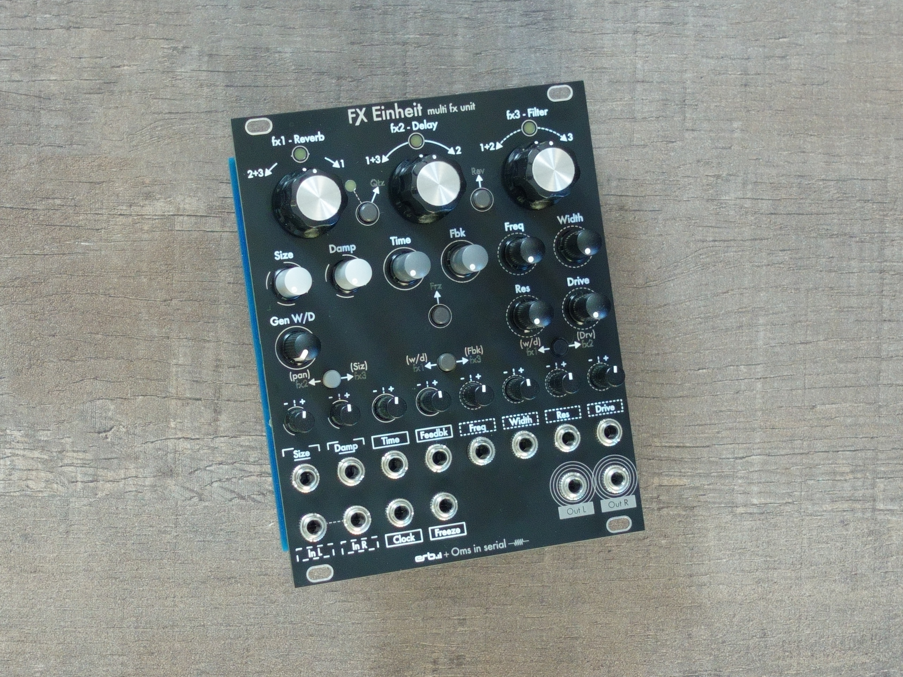
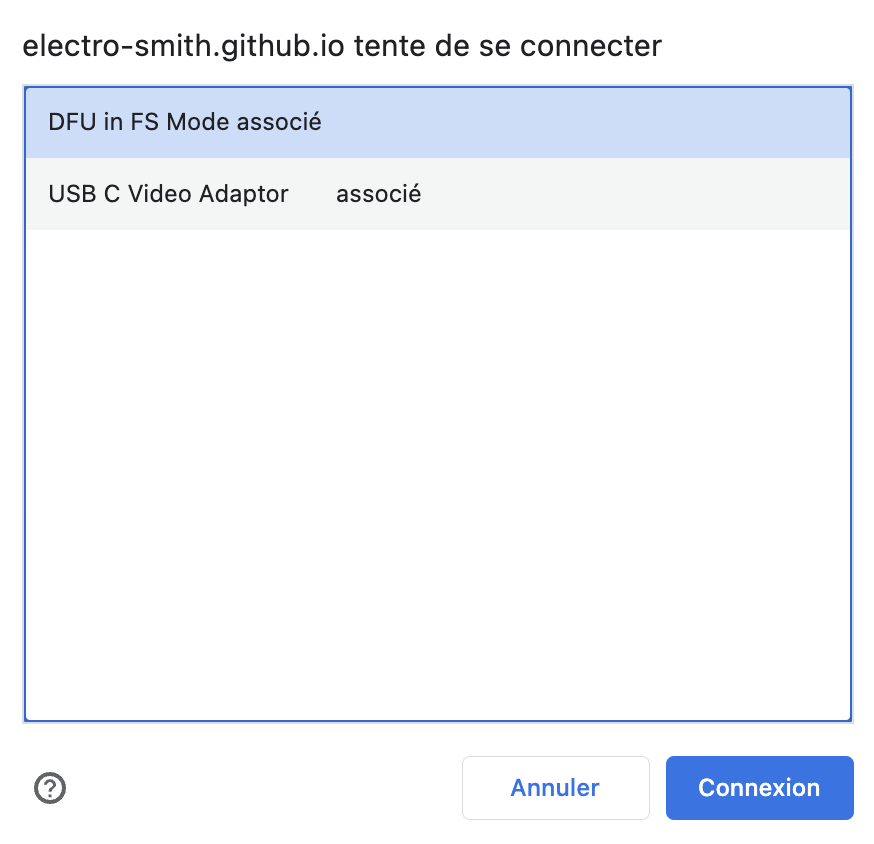
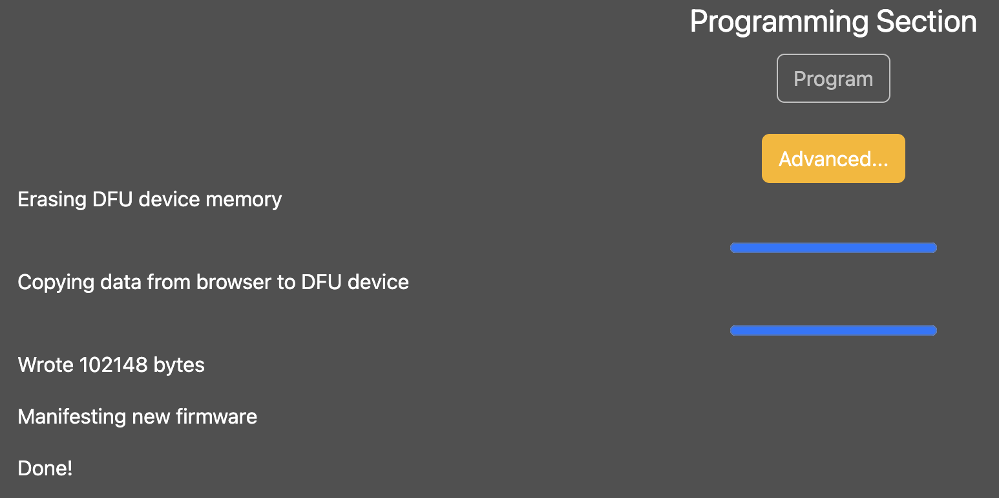

# FX Einheit eurorack module

FX Einheit is a stereo multi effects module based on Eurorack-Blocks framework + ElectroSmith Daisy Patch SubModule with a reverb, a delay and a multimode filter. Each of the 3 sections can process and output the incoming signal independently, but output from each section can be routed to another effect input. For instance, the delay can be routed to the reverb, which can be routed to the filter.

This module is developed under macOS with the help of [Erb Eurorack-Blocks](https://github.com/ohmtech-rdi/eurorack-blocks) framework + ElectroSmith Daisy Patch SubModule.

[Erb Eurorack-Blocks](https://github.com/ohmtech-rdi/eurorack-blocks) allows to test modules in the VCV Rack environment before going to the next stage of development.

## Controls
All details on my web page [https://omsinserial.com](https://www.omsinserial.com/p/fx-einheit.html)

## Downloading and installing the firmware
Download the latest firmware [here](https://github.com/OmsInSerial/Eurorack/blob/64045e767abf4f50f5bf27b4e83d277b7fbf8f35/FX%20Einheit/files/fxeinheit.bin). On the download page, click on the Download raw file button.
 

Current version is V1.3-28-04-24 Thanks to Mark Crosbie aka SynthDad (https://www.youtube.com/synthdad) for the suggestions
- Damping control behavior is inverted. Now at 0 (FCCW) there is no damping, at 1 (FCW) full damping. It makes more sens to act like this.
- To ease readability, routing Leds are now blinking instead of staying on when routing is engaged.
- For the same reason, CV alternate assignement Leds will blink twice the speed of routing Leds.

V1.2-29-03-24
- Fixed leaking signal on the stereo filter left channel from the right one.
- Routing algorithm improvement

You can use the [ElectroSmith web configurator page](https://electro-smith.github.io/Programmer/) to do so with a last updated Google Chrome.

Follow this procedure:

1. Connect the Daisy to the Computer with a micro USB cable.

2. Enter the system bootloader by holding the BOOT button down, and then pressing, and releasing the RESET button.

3. Click the Connect button at the top of the page.

4. Select, "DFU in FS Mode" and click connexion.

   

5. Click the Choose File button, and select the .bin file you downloaded.

6. Click Program, and wait for the progress bar to finish.

   

Now, if the program does not start immediatley, pressing RESET on the Daisy will cause the program to start running.

Requirements : 
In order to use this, you will need: an up-to-date version of Chrome, at least version 61 or newer

That's all! :+1:

All other details about FX Einheit are available here: [https://omsinserial.com](https://www.omsinserial.com/p/fx-einheit.html)
