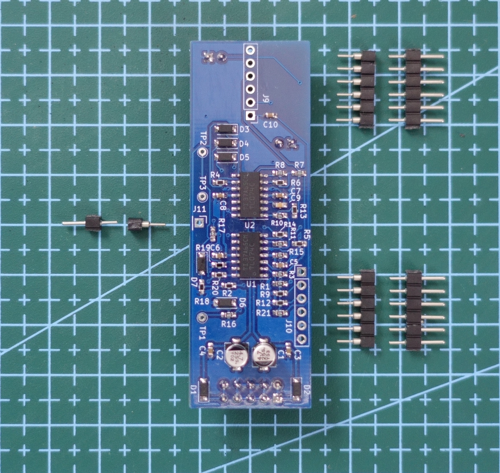
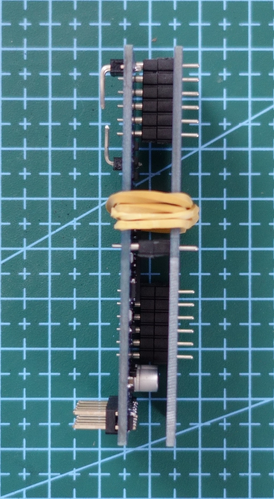

# Suiveur eurorack module

Suiveur is a simple envelope follower.
Plug an input signal, and you'll get its amplitude envelope, its inverted and a gate output driven by a treshold.

## Controls

A, B - In1 (AC coupled) and In2 (DC coupled)

C - In1 and In2 are added to produce one envelope Env

D - Inverted one -Env = -C. Incoming signal levels have to be controlled with an external atenuverter as Draag for instance.

E - Smooth pot sets the overall envelope shape.

F - Threshold pot sets the sensitivity. 

G - Gate stays opened until signal fall down back under the threshold. To set the threshold, first turn the threshold knob fully CCW. Then turn it CW until you trig the gate. Above this point, the more you turn CW, the longer the gate stays opened.

## DIY

Suiveur is avalaible as a DIY module, 2 PCBs + PCB panel set at Tindie or Modulargrid.

Here is the [BOM as a xlsx file](https://github.com/OmsInSerial/Eurorack/blob/803f410a7a337096858b008e448d7aa0b17eb168/Suiveur/files/Suiveurv2_1.xlsx) or [as a csv file](https://github.com/OmsInSerial/Eurorack/blob/803f410a7a337096858b008e448d7aa0b17eb168/Suiveur/files/Suiveurv2_1.csv) to source the parts with Mouser references for SMD/THT components and other providers (Thonk, Banzaï...). Click on the Download raw file button.
 

If you are not confortable with SMD soldering, you can buy the module fully built at Tindie or Modulagrid.

1. SMD parts on board A

| Placement         | Description   |Index|
| ------------------| ------------- |--------|
|      | TL074       |   U1,U2    |
|        | 1K resistors  |   R5,R12,R13,R14,R20  |
|       | 6K8 resistors |   R16,R17  |
|       | 10K resistors |   R2,R4,R6,R9,R18 |
|      | 20K resistor |   R7,R8 |
|      | 66K5 resistor |   R19 |
|        | 100K resistor   |   R1,R3,R10,R11,R15,R21 |
|      | 100n capacitors   | C3,C4,C5,C6,C7,C8,C10 |
|      | 1u capacitor   | C9 |
|  | Schottky Rectifiers  | D1,D2 |
|  | Diodes | D3,D4,D5,D6,D8 |
|      | 4u7 capacitors   | C1,C2 |

2. THD parts
   
First, place the power header and the 2 headers on the back on board A and solder them.

 

Prepare the two 1x6 male and female headers and the 1x1 male and female header.

Assemble them.

Place them on board A.

Get the B board and a ruber band.

And prepare the "sandwich" !

  

Solder all the pins. Get the rubber band off, and reopen the "sandwich". Board A is now completed. Focus on board B ;-)

Place the remaining THD parts on board B as indicated below, **but do not solder anything now!**

| Placement         | Description   |Index|
| ------------------| ------------- |--------|
|       | PJ398SM, common ground |   J1,J2,J3,J4,J5  |
|      | B100K, cut the orange part before placing the pot if exist   |   RV1, RV2    |
|     | Led     |   D8    |

Once every THD is placed on board B, secure the parts with the panel and screw every nuts. Be carefull with the led, it's very easy to bend the legs when placing the panel!

 

Now return board B + panel and solder THD parts.

You are done! Assemble the boards and do some tests.

3. Test

One thing I always do, is to check if there is a short with the power circuit. Get a multimeter, turn the dial to Continuity Test mode, place one lead to the negative pins and the other one to the positives as shown below. You shouldn't ear any BIP, if you do, it means you've a short somewhere on the board ...

Pic above is  not the actual Suiveur board, but you get the idea. Repeat the test between the ground pins and the positive and negative ones. You shouldn't ear anything!

4. Finishing
   
You can now put the pots knobs!

That's all! :+1:

All other details about Suiveur are available here: [https://omsinserial.com](https://www.omsinserial.com/p/blog-page_18.html)

